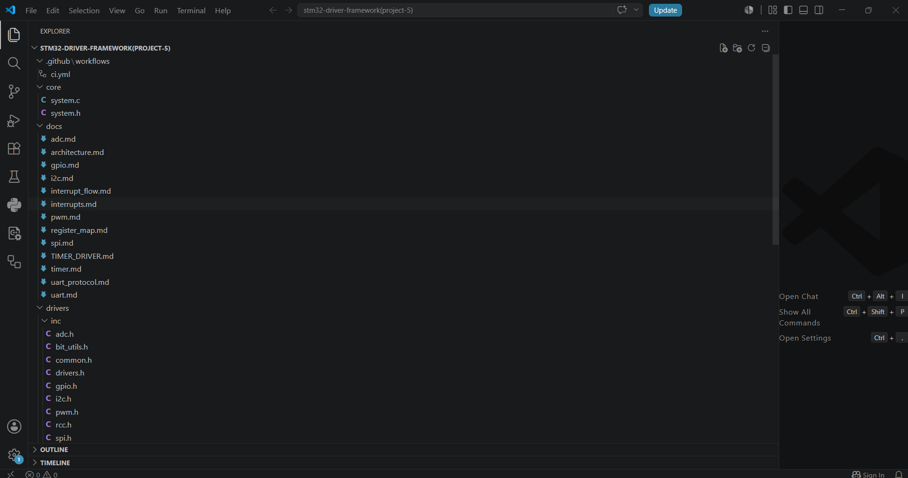
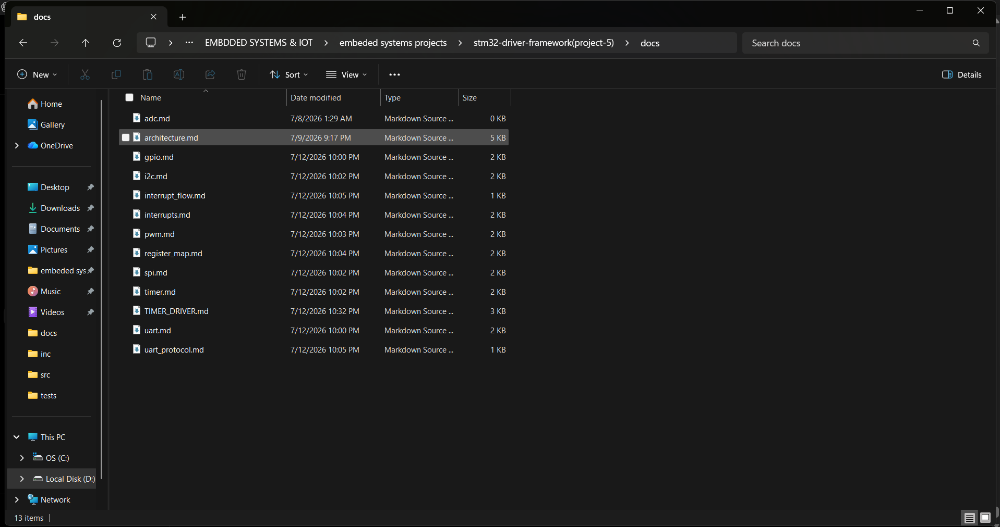
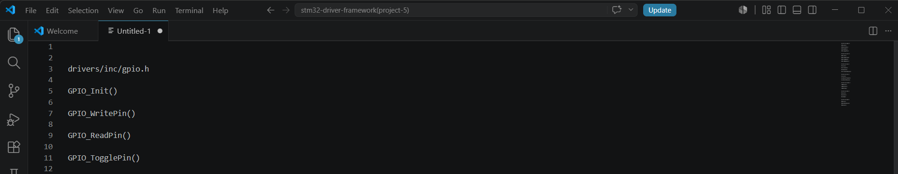
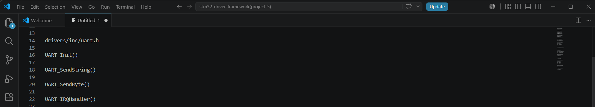
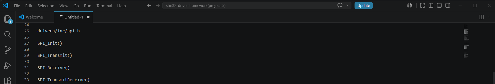
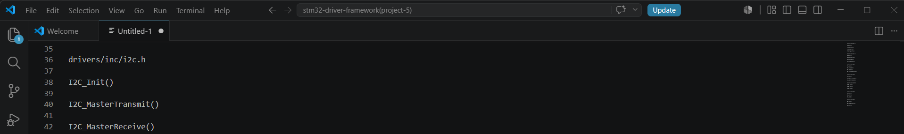
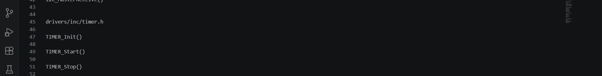
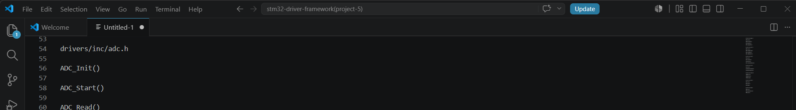
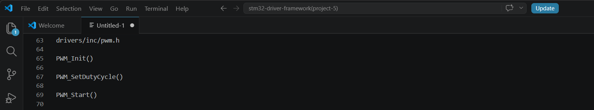
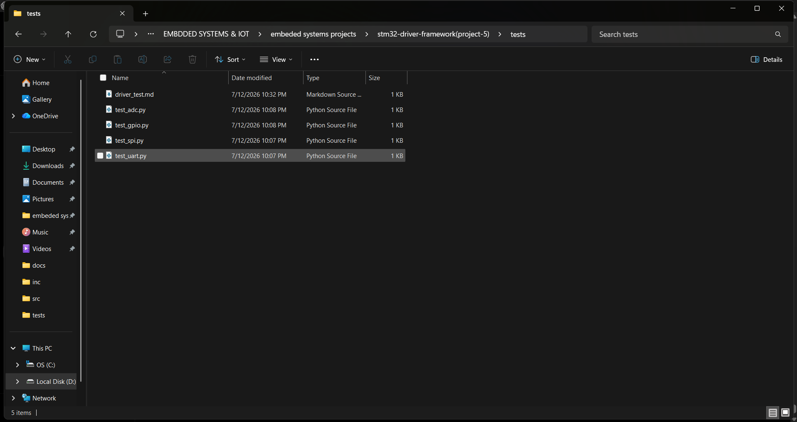

# 🚀 STM32F407VG Professional Driver Framework

> A production-quality **register-level embedded driver framework** for the **STM32F407VG (ARM Cortex-M4)** microcontroller, developed entirely without STM32 HAL, LL libraries, or CubeMX-generated drivers.


---

# 📖 Overview

This project demonstrates the implementation of a **professional embedded driver framework** for the **STM32F407VG** microcontroller using **direct register programming**.

Unlike STM32 HAL or LL libraries, every peripheral driver has been developed from scratch using the STM32 Reference Manual and CMSIS register definitions.

The framework follows a modular architecture commonly used in embedded product development and emphasizes reusable APIs, portability, interrupt-driven design, and professional coding practices.

---

# ✨ Project Highlights

✅ Register-Level Programming

✅ No HAL Library

✅ No LL Library

✅ No CubeMX Generated Drivers

✅ Professional Driver Architecture

✅ Modular Driver Design

✅ Interrupt Support

✅ Callback Mechanism

✅ Timeout Protection

✅ Error Handling

✅ Static Memory Allocation

✅ MISRA-Friendly Coding Style

✅ Production-Oriented APIs

✅ Professional Documentation

---

# 🧩 Supported Drivers

| Driver | Status | Features |
|---------|--------|----------|
| RCC | ✅ Complete | Clock Enable / Reset |
| GPIO | ✅ Complete | Input, Output, Alternate Function |
| UART | ✅ Complete | TX/RX, Ring Buffer, Interrupts |
| SPI | ✅ Complete | Master Mode, Full Duplex |
| I2C | ✅ Complete | Master TX/RX, Interrupts |
| TIMER | ✅ Complete | Counter, Delay, Callback |
| ADC | ✅ Complete | Single & Continuous Conversion |
| PWM | ✅ Complete | Frequency & Duty Cycle Control |

---

# 🏗 Driver Architecture

```
Application Layer
        │
        ▼
Driver APIs
        │
        ▼
Register Layer
        │
        ▼
STM32F407VG Hardware
```

---

# 📂 Project Structure

```
stm32-driver-framework
│
├── .github/
│   └── workflows/
│
├── core/
│
├── docs/
│   ├── gpio.md
│   ├── uart.md
│   ├── spi.md
│   ├── i2c.md
│   ├── timer.md
│   ├── pwm.md
│   ├── register_map.md
│   ├── interrupt_flow.md
│   └── uart_protocol.md
│
├── drivers/
│   ├── inc/
│   └── src/
│
├── examples/
│
├── screenshots/
│
├── tests/
│
├── README.md
├── LICENSE
├── requirements.txt
└── .gitignore
```

---

# ⚙️ Driver Features

## 🔹 RCC

- Peripheral Clock Enable
- Peripheral Clock Disable
- Peripheral Reset
- Modular APIs

---

## 🔹 GPIO

- Input Mode
- Output Mode
- Alternate Function
- Analog Mode
- Pull-Up / Pull-Down
- Output Speed
- Pin Read
- Pin Write
- Pin Toggle

---

## 🔹 UART

- Blocking Transmission
- Blocking Reception
- Interrupt Mode
- Ring Buffer
- Callback Support
- String APIs
- Integer APIs
- Float APIs
- Hexadecimal APIs

---

## 🔹 SPI

- Master Mode
- Full Duplex Communication
- Interrupt Support
- Callback Support
- Error Detection

---

## 🔹 I2C

- Master Transmit
- Master Receive
- Interrupt Support
- Callback Support
- Error Handling

---

## 🔹 TIMER

- Timer Initialization
- Counter Start/Stop
- Delay APIs
- Counter Read
- Counter Write
- Interrupt Support
- Callback Registration

---

## 🔹 ADC

- Single Conversion
- Continuous Conversion
- Interrupt Mode
- Callback Support
- Timeout Protection

---

## 🔹 PWM

- PWM Initialization
- Duty Cycle Control
- Frequency Control
- Output Enable
- Interrupt Support

---

# 🧪 Testing

The framework includes example applications and validation scripts for driver verification.

### Example Applications

- GPIO Demo
- UART Demo
- SPI Demo
- I2C Demo
- TIMER Demo

### Python Test Scripts

- test_gpio.py
- test_uart.py
- test_spi.py
- test_adc.py

---

# 💻 Build Environment

| Item | Value |
|------|------|
| IDE | STM32CubeIDE |
| MCU | STM32F407VG |
| Language | C17 |
| Compiler | GNU ARM Embedded GCC |
| Architecture | ARM Cortex-M4 |
| Programming Style | Register-Level |

---

# 🚀 Getting Started

Clone the repository

```bash
git clone https://github.com/YOUR_USERNAME/stm32-driver-framework.git
```

Open the project using **STM32CubeIDE**.

Explore the examples inside the `examples` folder.

Refer to the documentation available inside the `docs` folder.

---

# 📚 Documentation

Complete documentation is available for every driver.

Included documents:

- GPIO Driver
- UART Driver
- SPI Driver
- I2C Driver
- TIMER Driver
- PWM Driver
- Register Maps
- UART Protocol
- Interrupt Flow

---

# 📸 Project Screenshots

## 📂 Project Structure



---

## 📖 Documentation



---

## GPIO Driver



---

## UART Driver



---

## SPI Driver



---

## I2C Driver



---

## TIMER Driver



---

## ADC Driver



---

## PWM Driver



---

## Test Suite



---

# 📈 Future Roadmap

- DMA Driver
- CAN Driver
- USB Driver
- Ethernet Driver
- SDIO Driver
- Watchdog Driver
- RTC Driver
- Flash Driver
- Low Power Driver
- FreeRTOS Integration

---

# 🎯 Learning Outcomes

This project demonstrates knowledge of:

- Embedded C
- ARM Cortex-M4 Architecture
- STM32F4 Register Programming
- Peripheral Driver Development
- Interrupt Handling
- Embedded Software Architecture
- Modular Programming
- Professional API Design
- Callback Mechanism
- Static Memory Management
- Embedded Documentation

---

# 🤝 Acknowledgements

- STMicroelectronics
- ARM
- CMSIS
- STM32F407 Reference Manual
- STM32CubeIDE

---

# 📄 License

This project is licensed under the **MIT License**.

See the LICENSE file for details.

---

# 👨‍💻 Author

**Vedula China Venkata Prasanth**

🎓 B.Tech – Electronics & Communication Engineering

🏫 Lendi Institute of Engineering and Technology

📍 Andhra Pradesh, India

💻 Embedded Systems | Firmware Development | STM32 | ARM Cortex-M | IoT

---

⭐ If you found this project useful, consider giving it a **Star** on GitHub.